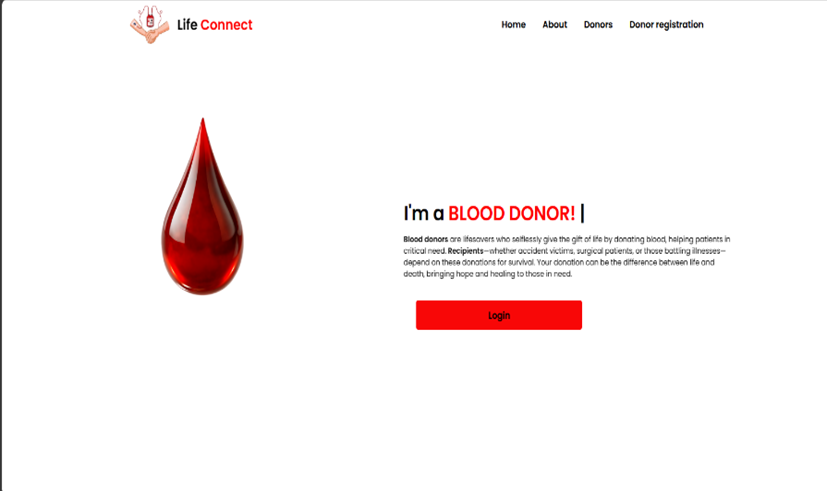
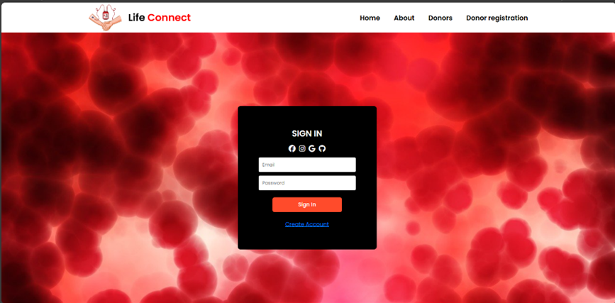
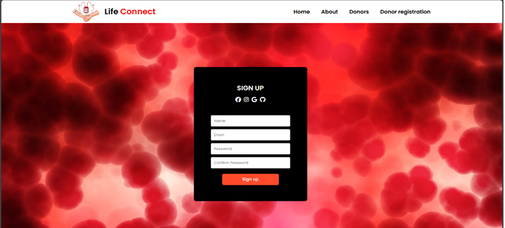
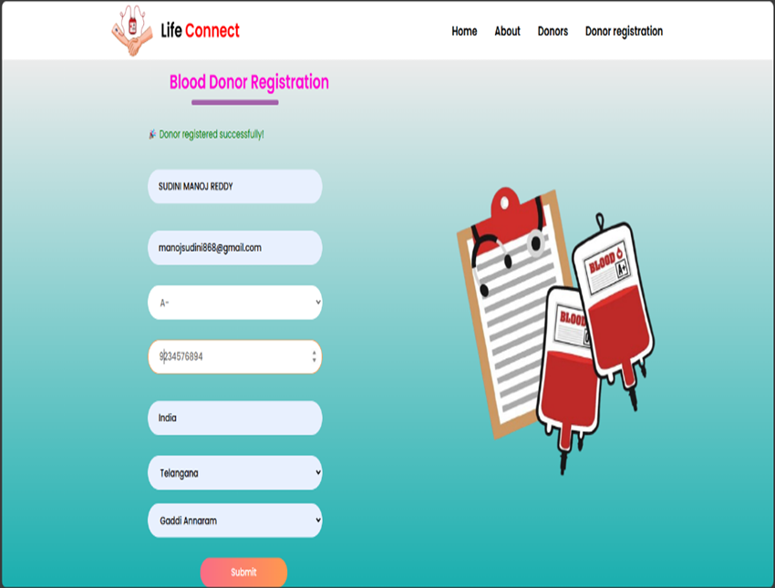
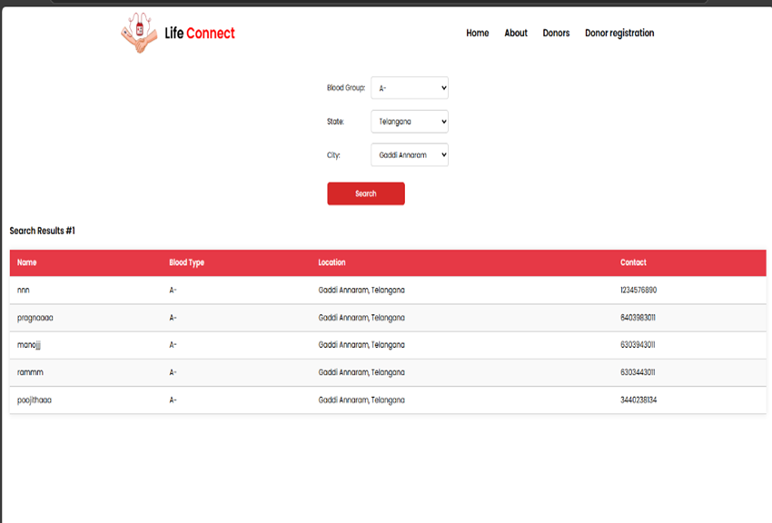

# 🩸 LIFE CONNECT

### A Smart Search Blood Donor Management System

LIFE CONNECT is a web application designed to connect blood donors with patients who are in need of blood. The platform helps users search for suitable blood donors based on blood group and location, register as donors, and manage emergency blood requests.

## 🚀 Features

- 🔍 Search donors based on blood group and location
- 🩸 Donor registration and profile management
- 🚨 Create and manage emergency blood requests
- 👤 User registration and authentication
- 📍 Location-based donor search
- 📊 Donor and patient dashboards
- 💾 Secure storage and management of application data
- 📱 Responsive and user-friendly interface

## 🛠️ Tech Stack

### Frontend
- React.js
- HTML5
- CSS3


### Backend
- Node.js
- Express.js

### Database
- MongoDB

### Tools & Platforms
- Git
- GitHub
- Visual Studio Code

  ## 📸 Screenshots

### 🏠 Home Page


### 🔐 Login Page


### 📝 Sign Up Page


### 👤 Registration Page


### 📊 Dashboard


## 📂 Project Structure

```text
LIFE-CONNECT/
│
├── public/
│
├── src/
│   ├── components/
│   │   ├── BloodAvailabilityGrid.js
│   │   ├── BloodDonationIllustration.js
│   │   ├── DashboardLayout.js
│   │   ├── DonorCard.js
│   │   ├── LocationPicker.js
│   │   ├── ProtectedRoute.js
│   │   ├── PublicLayout.js
│   │   ├── RequestCard.js
│   │   ├── SearchableSelect.js
│   │   ├── SiteFooter.js
│   │   └── SiteHeader.js
│   │
│   ├── context/
│   │   └── AuthContext.js
│   │
│   ├── data/
│   │
│   ├── pages/
│   │   ├── About.js
│   │   ├── Donor.js
│   │   ├── Home.js
│   │   ├── Login.js
│   │   ├── Patients.js
│   │   ├── Register.js
│   │   ├── Search.js
│   │   └── dashboard/
│   │
│   └── utils/
│
├── package.json
├── package-lock.json
├── tailwind.config.js
├── postcss.config.js
└── README.md
